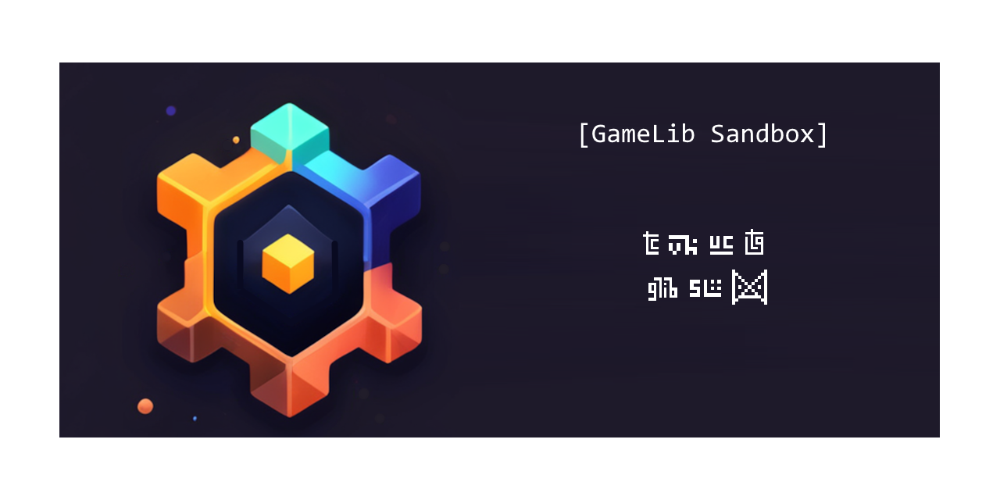

> [!WARNING]
> This repository is no longer maintained or supported. All showcases are moved to separate repositories 

# GameLibSandbox
Sandbox for testing and experimenting with my different libraries:
  * GameLib (https://github.com/cholushkin/gamelib)
  * TowerGenerator (https://github.com/cholushkin/TowerGenerator)
  * VersionHistory (https://github.com/cholushkin/VersionHistory)

Also contains experiments and examples of third parties libraries such as:
  * DoTween
  * ProBuilder

Also contains custom unit tests for GameLib and some other libraries.
Integration of all libraries to GameLibSandbox project is also an example of how to integrate them to your game and check out how all of them can live together. 
GameLibsSandbox always contains most recent version of modules and libraries. Unity version is also most actual.

[dependencies.md](dependencies.md)
